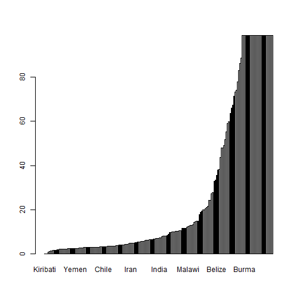

Developing Data Products Course Project
========================================================
author: James Kowalik
date: 06/09/2021
autosize: true

Introduction
========================================================

Completed as part of the Developing Data Products course in the Data Science Specialization by Johns Hopkins University. The instructions for this proeject were as follows.

- "First, you will create a Shiny application and deploy it on Rstudio's servers. Second, you will use Slidify or Rstudio Presenter to prepare a reproducible pitch presentation about your application."

My project is about the Covid-19 pandemic. As we approach a year and a half since the disease began to impact societies greatly all over the world, using maps created in plotly, I aim to provide a means for comparison between Covid-19 deaths in 2020 and in 2021. The user of my application will be able to see things such as which countries may have been largely unaffected by the initial outbreak but suffered from a huge relative increase in deaths as the virus spread further and wider. There will be 3 maps.

- The total number of deaths up until August 24th 2020.
- The total number of deaths up until August 24th 2021.
- The percentage growth in deaths from August 24th 2020 to August 24th 2021.

The Data
========================================================


In order to use plotly, I had to build a single dataset that included the deaths in 2020 and 2021 and the latitude and longitude of each country. A lengthy process, including use of forloops, mutations, factor re-labelling and the like, ended with merging datsets to get a final dataset looking like this.


```r
df4 <- merge(countries, df3, all = FALSE) %>% 
        select(-2) %>%
        rename(lat = 2, lng = 3)
head(df4)
```

```
              Country    lat   lng Deaths_2020 Deaths_2021 Percentage_Growth
1         Afghanistan  33.00  65.0        1390        7083              5.10
2             Albania  41.00  20.0         254        2480              9.76
3             Algeria  28.00   3.0        1446        5063              3.50
4             Andorra  42.50   1.5          53         130              2.45
5              Angola -12.50  18.5         100        1166             11.70
6 Antigua and Barbuda  17.05 -61.8           3          43             14.30
```

The Spread of the Data
========================================================

As can be seen in the following barplot, which shows the percentage growths, a lot of countries have growths over 100% (some even infinite as they had 0 deaths in the first year). This motivates use of sliders in my shiny app to facilitate comparison between countries that had similar figures. This, in effect, will be like 'zooming in' on certain ranges of numbers.


Links
========================================================

- Shiny App: [https://jamesk185.shinyapps.io/ddpCourseProject/](https://jamesk185.shinyapps.io/ddpCourseProject/)
- Code: [https://github.com/jamesk185/JHU-DSS-Developing-Data-Products-Course-Project/tree/main/JHU-DSS-Developing-Data-Products-Course-Project/ddpCourseProject](https://github.com/jamesk185/JHU-DSS-Developing-Data-Products-Course-Project/tree/main/JHU-DSS-Developing-Data-Products-Course-Project/ddpCourseProject)
